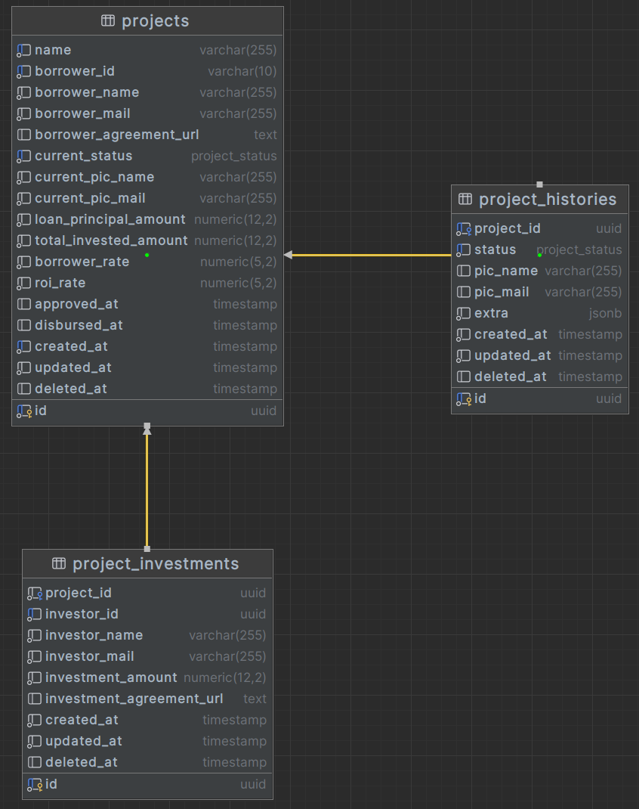

# Loan Engine

### Project Setup
- Install Goose Migration: 
  ```shell
  $ go install github.com/pressly/goose/v3/cmd/goose@latest
  ```
- Create .env:
  ```shell
  $ cp .env.example .env  // then update with your own.
  ```

- Run schema migration:
  ```shell
  $ make migrate
  ```
- Run the project:
  ```shell
  $ go run cmd/rest/main.go
  
  // or run from binary build.
  $ make build
  $ ./app.backend
  ```

# ERD


# Architecture

Notes:
- Loan Ranger is a backend service responsible to handle Loan Project from Creation until Disbursement.
- Loan Ranger has no authentication mechanism, assumed request validation is handled by Authentication Service.